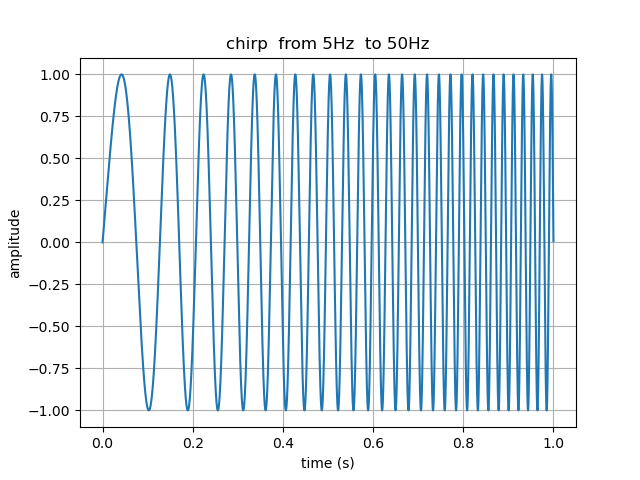
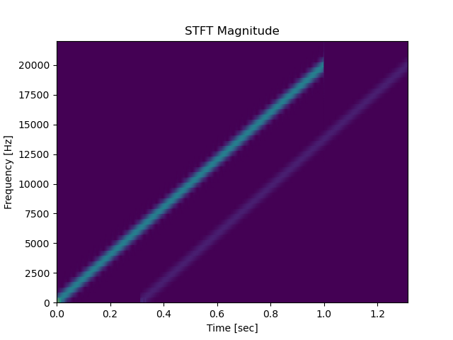
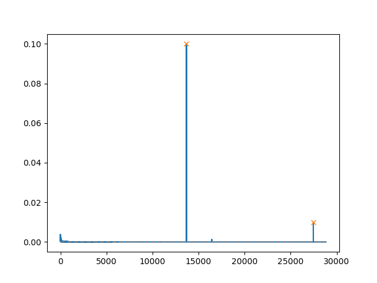
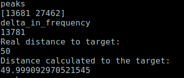

# FMCW_in_Python__How_to_calculate_the_distance
One of the many ways to do it in the audio context.

## Description
Yesterday a person asked me, how one could calculate the distance to a target in a FMCW audio RADAR/Sonar in a simple way. I responded to the person, but I intended to give him a example, so yesterday night I made a simple example with one of the several ways of doing it.  
The FMCW - Frequency Modulation of Continuous Wave, is a simple kind of radar. In it we send a chirp that is a tone in which the frequency goes up or down linearly with time. Then in the Spectrogram trough time we will see two ramps on the microphone input signal, one is the bleeding of the short path between the speaker and the microphone (they should be close) and another for the faint echo returned from target.  
At each instant they will be at different frequencies, and that difference in frequency is what's used to calculate the the difference in samples (regarded to the zero distance in witch they would be coincident ) and that will be used to calculate the distance to the target, with the input of the sample_rate and the sound velocity at the sea level (choose your high).  
There are several ways of obtaining the two instant frequencies F1 and F2, some of them I will list here:  

1. With a filter bank of several frequencies in the time domain, followed by a peak detector in each one and same processing  logic.
2. With the processing of the output of a SFFT.
3. With a bank of chirps that you give to a FFT.
4. And the one I implemented here, with Cepstrum calculation.

You can simulate a target distance and confirm that you detected the correct receiving distance, I tested from 1 meter to 50 meters. 

## A example of a graph of a linear chirp, in the time domain.

## The Spetrogram of the two chirps.

## The result of the Cepstrum

## Calculated distance to the target

## References
* Stimson's Introduction to Airborne Radar, 3th Edition   
  by George W. Stimson, Hugh D. Griffiths, et al.
  
* Fast Fourier Transform and Its Applications, 2nd Edition  
  by E. Brigham

## License
MIT Open Source

## Have fun
Best regards,  
João Carvalho